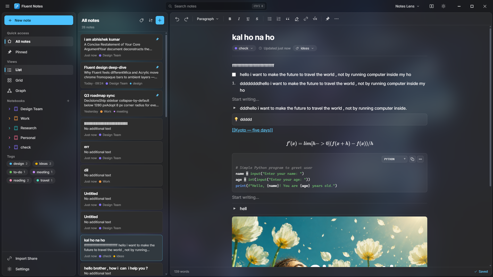

# Fluent Notes 🖊️

Fluent Notes is a local-first, private-by-design desktop note-taking and knowledge synthesis application tailored for researchers, developers, and academics. Built with Electron, Vite, TypeScript, and Bun, it provides a fluid workspace that helps you capture ideas, organize databases, visualize knowledge graphs, and collaborate without depending on central cloud servers.



---

## 🚀 Key Features

*   **Offline-First & Privacy-Centric:** All your notes are stored locally as standard files. There is no telemetry, no tracking, and zero cloud dependency.
*   **Decoupled Workflow Lenses:** Adapt the interface to fit your current cognitive task using specialized "Lenses":
    *   **Notes Lens:** A clean, focused interface for everyday journaling and standard note-taking.
    *   **Academic Lens:** Adds academic metadata tracking (Authors, Journal, Year) directly to your note's context.
    *   **Review Lens:** Renders a dedicated panel of **Transient Highlights** and clustered captures to help you crystallize raw thoughts into permanent, linked knowledge.
*   **Graph vs. Grid Views:**
    *   **List/Grid Views:** Sort, search, and manage your structured notes by title, notebook, tags, or creation date.
    *   **Knowledge Graph View:** Visualize bidirectional links (`[[wikilinks]]`) as nodes and edges to discover connections across your second brain.
*   **Dual-Theme Split Engine:** Real-time side-by-side split screen option showcasing both light and dark themes simultaneously.
*   **Rich WYSIWYG Editor:** Fully featured formatting (Bold, Italic, Underline, Strikethrough), list management, inline math equations (`√x` with LaTeX-style rendering), subfolders/subpages navigation, and note pinning.
*   **P2P Collaboration:** Export and import secure project bundles directly with collaborators via Peer-to-Peer sharing.
*   **Built-in Command Palette & Searching:** Global fuzzy search across all notes (`Ctrl+K`) and in-page highlighting search (`Ctrl+F`).

---

## 🛠️ Tech Stack

*   **Runtime & Package Manager:** [Bun](https://bun.sh/)
*   **Desktop Shell:** [Electron 43.2](https://www.electronjs.org/) (bundled with Electron Forge)
*   **Bundler & Build Tool:** [Vite 5](https://vitejs.dev/)
*   **Language:** [TypeScript](https://www.typescriptlang.org/)
*   **Styling:** Modern Vanilla CSS with responsive design system (supporting dual light/dark CSS variables)

---

## 📁 Project Architecture

Below is the directory structure for the project and application package:

```
fluent-notes/
├── .agents/             # Agent rules and configuration
├── publics/             # Application screenshots and static public assets
│   └── app.png          # App main interface preview image
├── my-app/              # Core Electron + Vite codebase
│   ├── src/             # Application source files
│   │   ├── app/         # Component and view handlers
│   │   │   ├── components/  # Core UI components (Flyout, P2P Sync, Prompt dialogs)
│   │   │   ├── views/       # Application views (Editor, Sidebar, List, Review Inbox)
│   │   │   └── context.ts   # UI App Context
│   │   ├── constants/   # App constants, icons (IC), and window controls
│   │   ├── store/       # Local reactive stores and data persistence
│   │   ├── types/       # TypeScript type interfaces
│   │   ├── utils/       # Utility functions and helper scripts
│   │   ├── main.ts      # Electron Main Process entrypoint
│   │   ├── preload.ts   # Electron Preload script
│   │   └── renderer.ts  # Electron Renderer Process bootstrap
│   ├── package.json     # Node/Bun scripts & configuration
│   └── tsconfig.json    # TypeScript compiler configuration
└── README.md            # This documentation file
```

---

## 🏁 Getting Started

Follow these steps to run a local instance on your development machine:

### 1. Prerequisites
Ensure you have [Bun](https://bun.sh/) installed:
```bash
# Verify Bun installation
bun --version
```

### 2. Installation
Clone this repository to your local machine, then navigate to the app workspace:
```bash
cd my-app
bun install
```

### 3. Running in Development
To start the Electron desktop shell in hot-reloaded development mode:
```bash
bun start
```

---

## 📜 Available Scripts

Run the following commands inside the `my-app` directory:

| Command | Action |
| :--- | :--- |
| `bun start` | Launches the Electron Forge development server. |
| `bun run test` | Runs the test suites using Vitest. |
| `bun run lint` | Runs ESLint configuration to verify TypeScript syntax rules. |
| `bun run package` | Bundles the Electron application for production packaging. |
| `bun run make` | Generates final platform-specific installers (Squirrel/zip/deb/rpm). |

---

## ⌨️ Keyboard Shortcuts

| Shortcut | Description |
| :--- | :--- |
| `Ctrl + K` | Focuses the global notes search bar |
| `Ctrl + F` | Opens in-page search bar |
| `Ctrl + N` | Creates a new note |
| `Ctrl + Shift + N` / `Ctrl + T` | Opens a new application window |
| `Ctrl + L` | Copies the link of the active note to the clipboard |
| `Ctrl + Shift + L` | Toggle theme (Light/Dark mode) |
| `Ctrl + [` | Navigates history backward |
| `Ctrl + ]` | Navigates history forward |
| `Escape` | Closes open flyouts, prompt dialogs, or sidebar |
