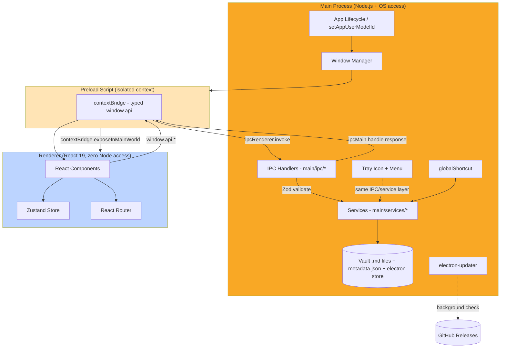
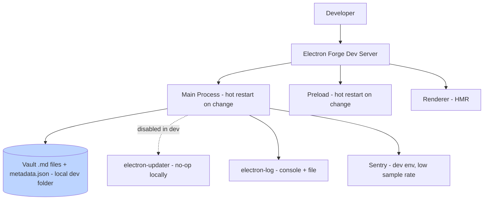
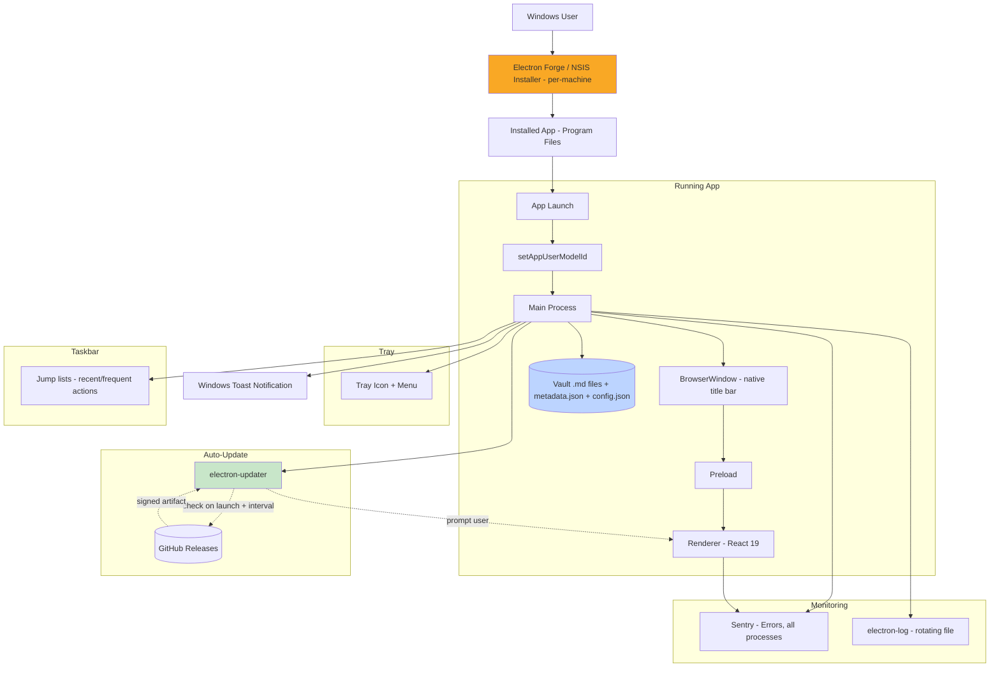
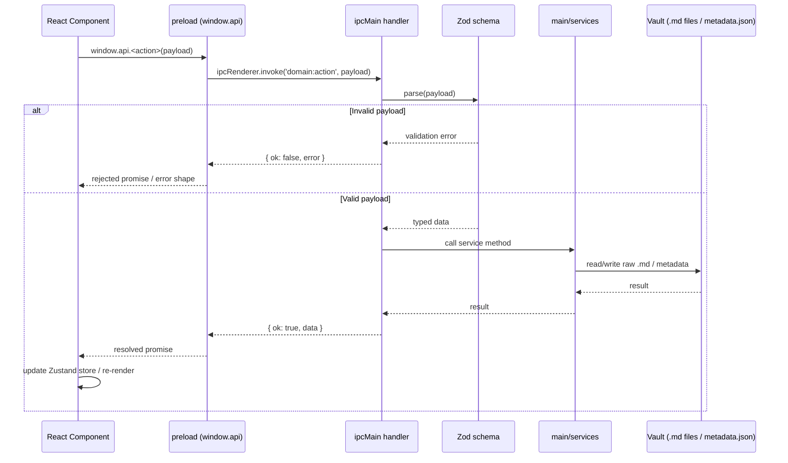
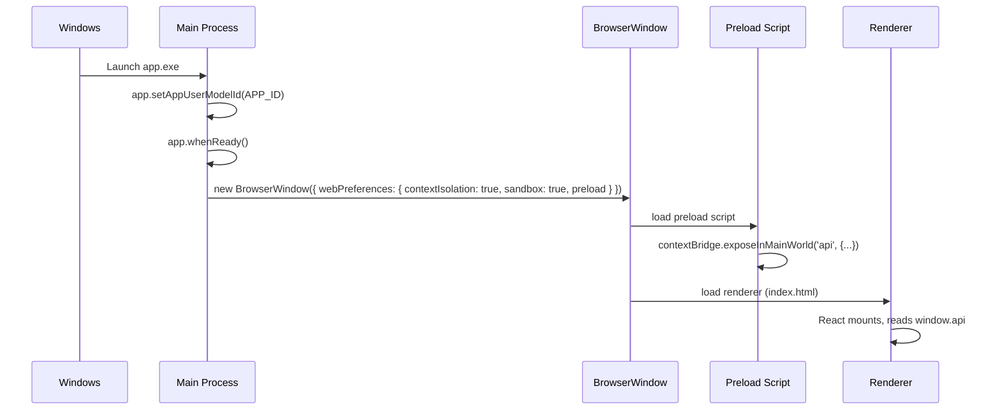
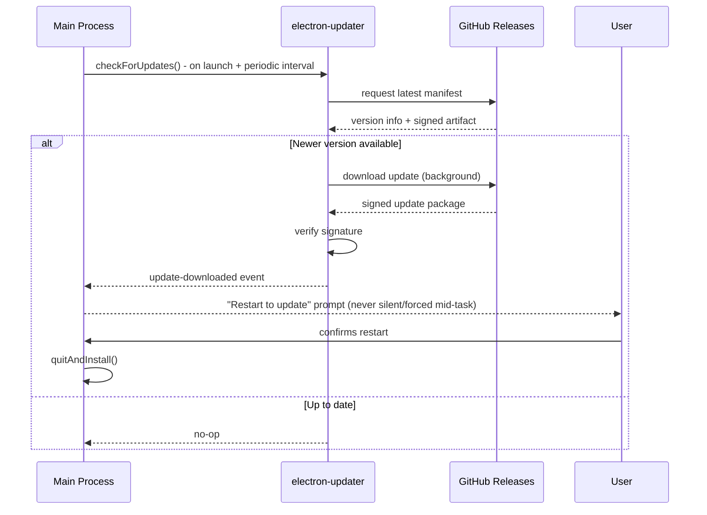
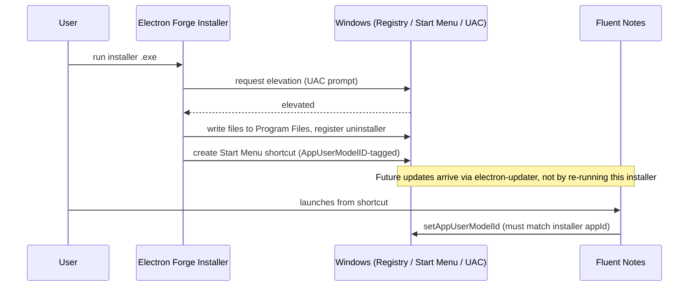

# Architecture — Fluent Notes

Reference architecture for Fluent Notes, aligned with the project constitution in `AGENTS.md`.
Every diagram and section below reflects only the tools actually chosen for this project —
nothing is included speculatively.

---

## 1. Architecture Diagrams

### 1.1 Process Model



**Why the shading matters:** the main process (orange) is the only one with OS/filesystem power.
The preload script (tan) is a narrow, intentional gap in the isolation — it exists only to hand
the renderer (blue) a small typed API. Nothing should ever widen that gap back into a full Node
bridge. Note that `Shortcuts` fans out to `Services` rather than directly to a window — a global
shortcut trigger lazily creates the Sticky Notes or Progress Tracker `BrowserWindow` through the
same service layer any other entry point uses, it never holds a standing reference to one.

### 1.2 Development Environment



### 1.3 Production / Packaged Environment



---

## 2. Lifecycle Diagrams

### 2.1 Core IPC Request Lifecycle

Always included — this is the base call path for any renderer action that needs main-process
data, regardless of which optional services are in the stack.



### 2.2 App Startup & Window Creation Lifecycle



### 2.3 Auto-Update Lifecycle


**Key principle:** the download happens in the background; the install/restart never happens
without a user-visible prompt, and the artifact is verified against the same signing key as the
installer — an update channel is only as trustworthy as that key.

### 2.4 Windows Installer Lifecycle



---

## 3. Integration Mapping

Only pairs of tools that are both present in this stack are documented below.

**Main process ↔ Preload ↔ Renderer** — the only sanctioned path for any data or command to cross
a process boundary. Every crossing is a named `domain:action` IPC channel, validated with Zod on
the main-process side, typed end-to-end via the preload's `index.d.ts`.

**AppUserModelID ↔ Installer `appId`** — must be identical, or Windows fails to correctly
group the app's windows in the taskbar and attributes toast notifications to "Electron" instead
of Fluent Notes.

**electron-updater ↔ Electron Forge ↔ Code Signing** — the update artifact electron-updater
downloads must be signed with the same certificate as the installer, or Windows (and
electron-updater's own signature check) rejects it.

**Vault `.md` files / metadata.json ↔ main/services ↔ IPC handlers ↔ Zustand** — raw `.md` files in
the user's local Vault folder are the live storage format and sole source of truth for notes.
Metadata (tags, structure) lives in `.fluent-notes/metadata.json`. The renderer's Zustand store
holds a client-side cache of UI state and loaded notes, never the source of truth.

**Tray ↔ main/services** — tray menu actions call the exact same service functions as their
in-window equivalents, so behavior never diverges between the two entry points.

**Notification API ↔ Main process only** — constructed and shown from `main/`; the renderer
requests one over IPC, it never constructs a `Notification` itself.

**Taskbar API ↔ main/services** — `setThumbarButtons`/`setProgressBar`/`setOverlayIcon` calls are
triggered by service-layer state changes, not called ad hoc from IPC handlers, so the taskbar
always reflects real app state.

**Protocol handler ↔ `second-instance` event** — on Windows, a deep link into an already-running
app arrives via the `second-instance` event, not `open-url` — the app must listen for both to
cover cold-start and already-running cases.

**globalShortcut ↔ main/services ↔ lazy BrowserWindow creation** — both the Sticky Notes and
Progress Tracker shortcuts resolve through the service layer, which creates their respective
`BrowserWindow` on first trigger rather than holding one open at all times.

**Links & Backlinks ↔ Graph view** — `[[page]]` references are parsed on save from raw `.md` files
into an index / link list (`from_page`, `to_page`); the Backlinks pane queries it for one page, and
Graph view queries the link graph to build the `d3-force` node/edge set.

---

## 4. Folder Structure

```
.
├── src/
│   ├── main/                       # Node.js + OS access — nothing here ships to the renderer
│   │   ├── index.ts                # app lifecycle, setAppUserModelId, window creation
│   │   ├── ipc/
│   │   │   ├── pages.ts            # ipcMain.handle('domain:action', ...), Zod-validated
│   │   │   ├── links.ts            # backlinks + graph-view queries against link index
│   │   │   ├── canvas.ts
│   │   │   ├── sticky-notes.ts
│   │   │   ├── progress-tracker.ts
│   │   │   └── settings.ts
│   │   ├── services/                # business logic, called from ipc/ handlers only
│   │   │   ├── pages.service.ts     # raw .md file read/write in Vault folder
│   │   │   ├── links.service.ts     # parses [[links]] from .md files on save
│   │   │   ├── canvas.service.ts
│   │   │   ├── sticky-notes.service.ts
│   │   │   └── progress-tracker.service.ts
│   │   ├── tray.ts
│   │   ├── updater.ts
│   │   ├── global-shortcuts.ts
│   │   └── windows/
│   │       ├── createMainWindow.ts
│   │       ├── createStickyNoteWindow.ts
│   │       └── createProgressTrackerWindow.ts
│   │
│   ├── preload/
│   │   ├── index.ts                 # contextBridge surface — no business logic
│   │   └── index.d.ts               # window.api type declaration, shared with renderer
│   │
│   └── renderer/
│       ├── index.html
│       └── src/
│           ├── main.tsx
│           ├── App.tsx
│           ├── components/
│           │   ├── PageEditor/         # Markdown editor
│           │   ├── PageTreeSidebar/    # nested-page hierarchy matching hard drive folders
│           │   ├── GraphView/          # d3-force link graph
│           │   ├── CanvasBoard/
│           │   ├── StickyNotePanel/
│           │   ├── ProgressTrackerPanel/
│           │   └── BacklinksPane/
│           ├── store/                # Zustand — UI state + client-side data cache
│           │   ├── pagesStore.ts
│           │   ├── canvasStore.ts
│           │   └── settingsStore.ts
│           ├── hooks/
│           ├── lib/
│           │   └── assets.ts         # centralized image/icon imports
│           ├── routes/
│           └── types/
│
├── resources/                        # installer icon, tray icon — never bundled into renderer JS
│   ├── tray-icon.png
│   └── icon.ico
│
├── build/                             # packaging config — installer targets, signing, publish
│
├── config/                            # env-driven config, read only from src/main
├── tsconfig.main.json
├── tsconfig.preload.json
├── tsconfig.renderer.json
└── tsconfig.json                      # project references, ties the three together
```

**Why each folder exists:**
- `src/main/` is a hard boundary: nothing here is ever bundled into the renderer. `ipc/` stays
  thin (validate + delegate); `services/` holds the actual business logic (reading/writing raw `.md` files), kept separate so it's
  testable without spinning up `ipcMain` at all. `windows/` isolates the three window-creation
  factories — main, sticky note, progress tracker — since all three are lazily invoked from
  different entry points (app launch vs. global shortcut).
- `src/preload/` is deliberately tiny — a glance at `index.ts` should show the entire renderer-
  facing API surface of the app in one file.
- `src/renderer/src/store/` is intentionally small and separate — it's a UI state cache the IPC
  layer populates, not a second source of truth.
- `resources/` sits outside `src/` on purpose: these are native-facing assets consumed at build
  time, never by the renderer bundler.
- Three separate `tsconfig.*.json` files (tied together by the root `tsconfig.json`'s project
  references) exist because main, preload, and renderer genuinely have different available
  globals (`process`, `window`) and different `lib`/`types` needs.