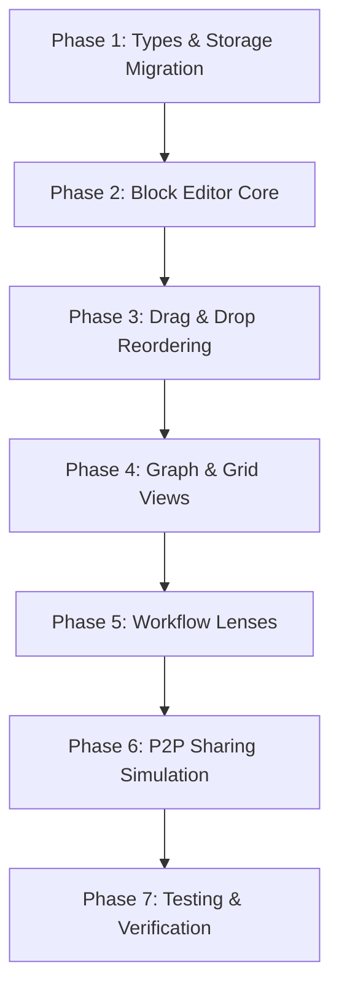

# Implementation Plan: Extended Fluent Notes (Research OS Edition)

This plan outlines the steps to extend the current **Fluent Notes** Electron application with the research features discussed in [RESEARCH.md](file:///D:/MyProjects/Apps-build/Winodows-app/simple-chat/RESEARCH.md) and [SPEC.md](file:///D:/MyProjects/Apps-build/Winodows-app/simple-chat/docs/SPEC.md), following your decisions in the `/grill-me` session.

---

## 1. Architectural Decisions Summary

* **Data Model:** Replace HTML-based `body: string` with a structured `blocks: Block[]` array (with `children: Block[]` support) nested in the `Note` object and serialized to `localStorage`.
* **Block Editor:** Notion-style block editor inside each note:
  * Keyboard-driven block creation (`Enter` for new block, `Backspace` to delete, `ArrowUp`/`ArrowDown` for focus navigation).
  * Formatting via `/` slash menu (Paragraph, H1, H2, To-do).
  * Markdown shortcuts (`# `, `## `, `- [ ] `).
  * Indentation/Nesting via `Tab` / `Shift-Tab` (up to 3 levels deep).
  * Reordering via 6-dot drag handle on block hover.
* **Views Switcher:** Toggle note collections in the list pane between:
  * **List:** Current standard note cards list.
  * **Grid:** A metadata table (columns: Title, Notebook, Tags, Date).
  * **Graph:** An interactive SVG-based graph visualization mapping WikiLinks (`[[Note Title]]` or `@Note Title` inside blocks).
* **Workflow Lenses:** A switcher in the Titlebar to morph the interface:
  * **Notes Lens (Default):** Standard layout.
  * **Academic Lens:** Focuses on literature metadata (displays input fields for Authors, Journal, Year) and highlights a backlinks section at the bottom of the editor.
  * **Review Lens:** Displays a split-screen view: Left pane shows a grouped "Transient Highlights Inbox" (with clusters like "Interface Physics" and "Material Design"); Right pane shows the permanent note editor, allowing users to drag highlights into the editor or click "Synthesize" to auto-draft.
* **P2P Sub-Graph Sharing:** A "Share Sub-graph" feature showing a boundary visualizer (project closure calculations, truncated external links) and exporting/importing a `.researcher-share` JSON payload.

---

## 2. Implementation Phasing

### Phase 1: Types & Storage Migration
1. Update types in `my-app/src/renderer.ts`:
   * Define `BlockType = 'paragraph' | 'heading1' | 'heading2' | 'todo'`
   * Define `Block` interface with recursive `children: Block[]`.
   * Extend `Note` interface with `blocks: Block[]`, `authors?: string`, `journal?: string`, `year?: string`, `status?: 'transient' | 'permanent'`.
2. Update the default mock notes dataset (`DEFAULT_NOTES`) to parse raw HTML notes into structured blocks, or seed clean structured note blocks.
3. Update `loadNotes()` and `saveNotes()` to handle the updated `Note[]` objects in `localStorage`.

### Phase 2: Block Editor Core
1. Implement the recursive block renderer `renderBlockTree(blocks: Block[]): string` generating the editor DOM nodes.
2. Implement block interaction event listeners:
   * **Text editing:** Edit `content` field of block on inputs.
   * **Keyboard navigation:** Focus previous/next block on `ArrowUp`/`ArrowDown`.
   * **Block insertion/deletion:** Pressing `Enter` inserts a new sibling block; pressing `Backspace` at the start of a block merges it with or deletes it into the previous block.
   * **Nesting:** Tab moves current block to the `children` of the preceding sibling block (incrementing indentation level up to 3). Shift-Tab outdents the block.
3. Implement `/` Slash command popup:
   * Triggers floating popup under cursor when `/` is typed.
   * Mouse/keyboard arrows to choose block type (Paragraph, H1, H2, To-do).
   * Selection inserts the block, replaces `/` character, and sets focus.
4. Implement Markdown shortcuts:
   * Detect `# `, `## `, or `- [ ] ` at the start of a paragraph block, instantly converting the block type.

### Phase 3: Drag & Drop Reordering
1. Modify block container HTML to render a hidden `::before` or hover-based `win-drag-handle` 6-dot icon on the left.
2. Add drag start, drag enter, drag over, drop, and drag end handlers on the block elements.
3. Show visual indicator (drop target highlight) during drag.
4. Reposition blocks in the state structure recursively based on drop target and update the DOM and `localStorage`.

### Phase 4: Graph & Grid Views
1. **Views Switcher:** Add segment buttons in the List pane header.
2. **Grid View:**
   * Render a `<table class="grid-table">` of filtered notes with sorting support for each column.
3. **Graph View:**
   * Render an `<svg class="graph-svg">`.
   * Parse note references in block contents using a regex like `/\[\[(.*?)\]\]|@([a-zA-Z0-9\s-_]+)/g`.
   * Build a node list (all notes) and edge list (parsed reference matches).
   * Build a lightweight 2D physics layout (or simplified center-force canvas layout) using Javascript to position nodes and draw edges.
   * Support dragging nodes, and clicking a node to select and load that note.

### Phase 5: Workflow Lenses
1. **Lens Switcher:** Add a dropdown/button in the top Titlebar for "Notes Lens", "Academic Lens", and "Review Lens".
2. **Academic Lens:**
   * Reveal input fields (`Authors`, `Journal`, `Year`) at the top of the editor metadata.
   * Compute a backlinks index dynamically: find all notes referencing the selected note title or ID.
   * Render a "Backlinks" list at the bottom of the editor.
3. **Review Lens:**
   * Toggle split-pane view in `.app-body`.
   * Render a left-hand "Transient Inbox" displaying pre-seeded transient clips grouped by cluster (e.g. "Interface Physics").
   * Render "Synthesize" button on each cluster which creates a new note, pre-populating its blocks with the highlights.
   * Allow dragging clippings from the inbox into editor blocks.

### Phase 6: P2P Sharing Simulation
1. Add a "Share Sub-graph" button.
2. Calculate the "closure" of notes recursively linked from the active note or tag.
3. Warn about external private links that are NOT in the tag/notebook.
4. Open a clean dialog overlay showing:
   * Shared Notes (green nodes)
   * Safely truncated links (dotted gray lines)
   * Export encrypted JSON string button and Import string box.

### Phase 7: Verification & Testing
1. Create a unit test file `my-app/src/__tests__/store.test.ts` to test block structure creation, deletion, WikiLink extraction, and sharing closure calculation.
2. Execute tests using `npm run test` to verify logic correctness.
3. Run the Electron application to visually inspect the implementation in both light and dark panes.
